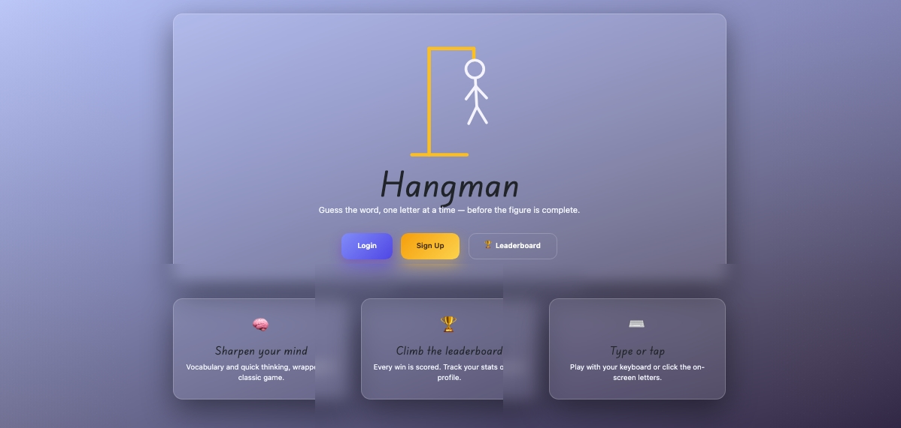
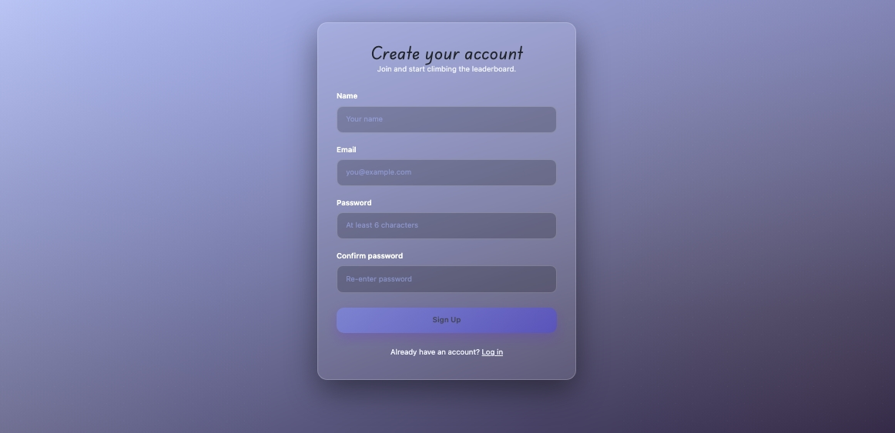
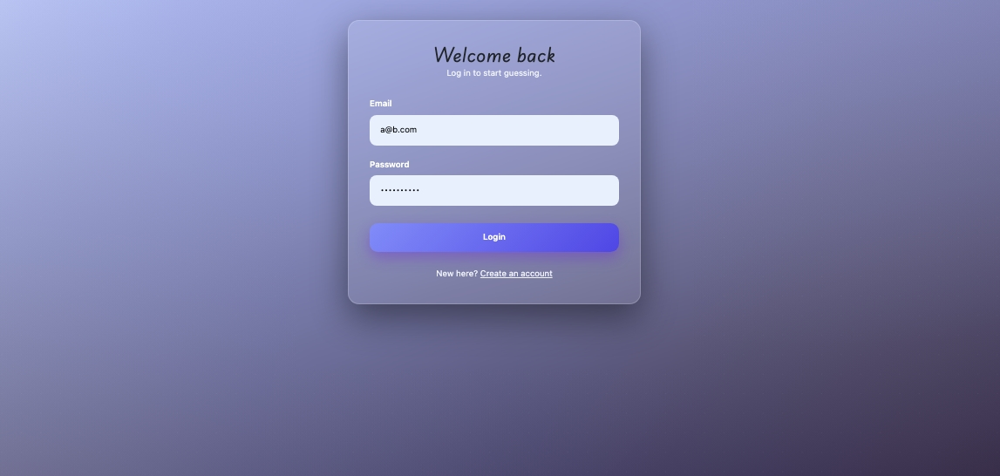
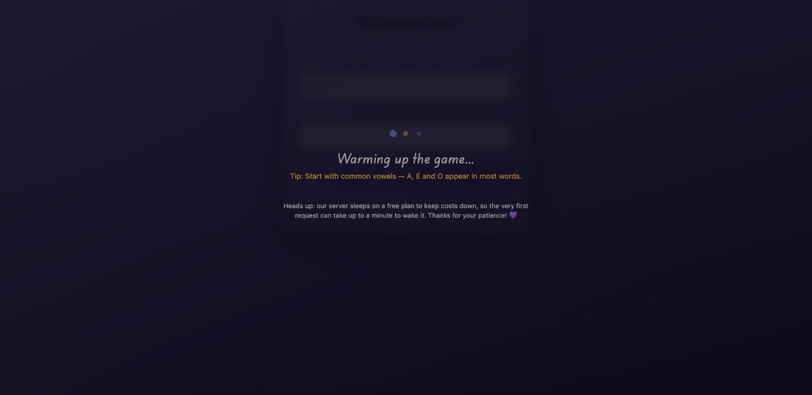
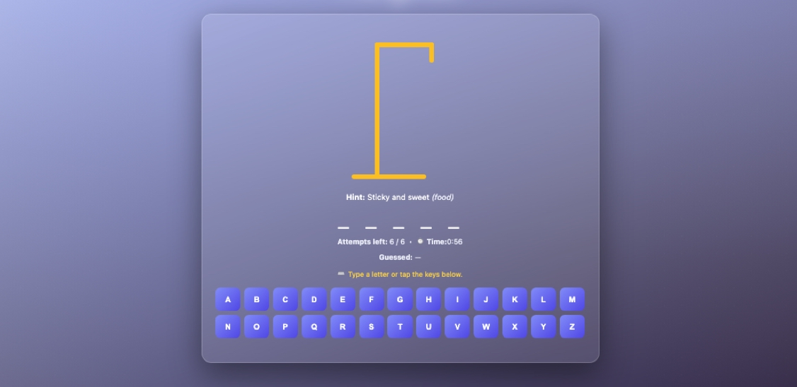
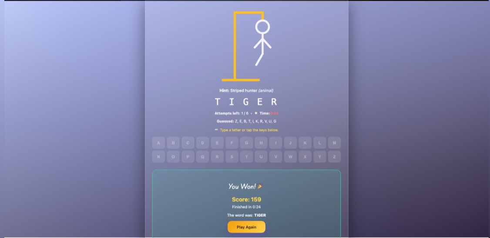
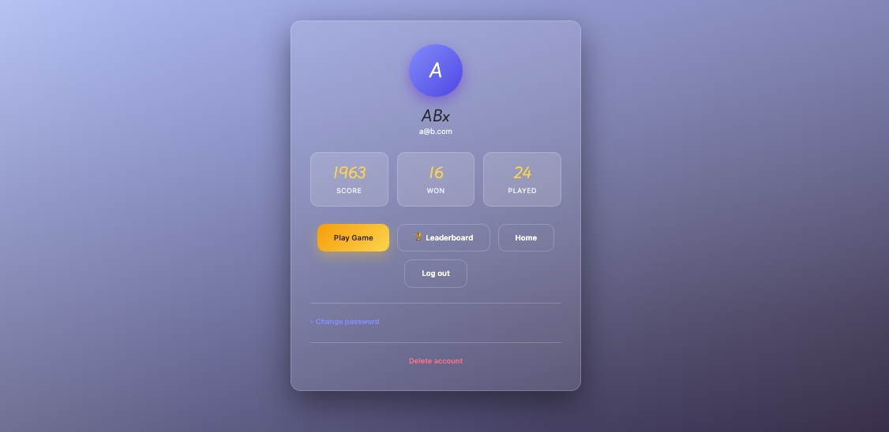
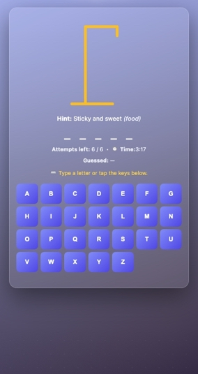

<h1 align="center">🪢 Hangman  Full-Stack Web Application</h1>

<p align="center">
  <em>A classic word-guessing game, rebuilt as a complete, production-deployed, multi-tier web application.</em>
</p>

<p align="center">
  <a href="https://lynx1097.github.io/Hangman-Web-App/app/"></a>
</p>

<p align="center">
  
  
  
  
  
  
</p>

---

## 📖 About this project

This project was originally built as **coursework for a comprehensive Web Development course** in December 2024 . and It's revived now and repolished to be added to the portfolio .

> [!NOTE]
>  the architecture is intentionally comprehensive because the course required demonstrating a wide range of technologies. The pay-off is a genuinely decoupled, scalable design where each tier can evolve, scale, and deploy on its own.

---

## 🖼️ Screenshots

### Home (Angular)
<p align="center"></p>

### Sign Up (Angular)
<p align="center"></p>

### Login + cold-start loader (Angular)
<p align="center"></p>
<p align="center"></p>

### The Game  in progress (Vue)
<p align="center"></p>

### The Game  win / loss states (Vue)
<p align="center"></p>

### Profile & stats (Angular)
<p align="center"></p>

### Mobile / responsive views
<p align="center"></p>

---

## 🏗️ Architecture at a glance

```
                   ┌──────────────────────────────────────────┐
                   │                The Player                │
                   └─────────────────────┬────────────────────┘
                                         │
            ┌────────────────────────────┴─────────────────────────────┐
            │                                                          │
            ▼                                                          ▼
┌───────────────────────────┐                         ┌───────────────────────────┐
│   hg-front-game (Angular) │                         │   hangman-game (Vue 3)    │
│  ─────────────────────────│                         │ ──────────────────────────│
│  • Home / marketing       │   shared Bearer token   │  • The actual gameplay    │
│  • Sign up / Login        │  ───────────────────►   │  • Animated SVG hangman   │
│  • Profile & stats        │   (localStorage +       │  • Keyboard + on-screen   │
│  • Auth guard/interceptor │    ?token= handoff)     │    keypad input           │
│  GitHub Pages: /app/      │                         │  GitHub Pages: /game/     │
└─────────────┬─────────────┘                         └─────────────┬─────────────┘
              │                                                     │
              │            REST + Sanctum Bearer tokens             │
              └────────────────────────┬────────────────────────────┘
                                       ▼
                       ┌─────────────────────────────────┐
                       │      hg-backend (Laravel 11)    │
                       │  ───────────────────────────────│
                       │  • REST API (/api/*)            │
                       │  • Sanctum token auth           │
                       │  • Game logic (word is secret)  │
                       │  • Leaderboard & user accounts  │
                       │  Render (Docker, PHP 8.3+Apache)│
                       └───────────────┬─────────────────┘
                                       ▼
                       ┌────────────────────────────────┐
                       │     TiDB Cloud (MySQL, TLS)    │
                       └────────────────────────────────┘
```

---

## 🧩 The three applications

### 1. `hg-backend`  Laravel 11 REST API 

The backend owns **all** game state and secrets. The word being guessed **never leaves the server** until the game ends  clients only ever receive the *masked* word, the hint, and the count of remaining attempts. Every guess is validated and scored server-side, which makes the game impossible to cheat from the browser.

**Highlights**
- **Laravel 11** on **PHP 8.2+**, served via **Apache** in a Docker container.
- **Laravel Sanctum 4** issues stateless **Bearer tokens** on register/login; protected routes sit behind the `auth:sanctum` middleware.
- **Eloquent ORM** models  `User`, `Game`, `LeaderboardEntry`  with migrations for full schema versioning.
- **Word sourcing with graceful fallback:** new games pull a word + hint from an external word API, and **transparently fall back to a built-in word list** if the API is unavailable  the game never breaks.
- **Anti-repetition word selection:** each new game avoids any word the player has already been served (derived from their existing `games` rows), so they cycle through *every* available word once before any repeats. When the pool is exhausted the history is transparently recycled, so a game can always start.
- **Skill-based scoring** computed entirely server-side: a base score from word length, a **near-miss multiplier** (winning with only one guess left multiplies the score by `1 + 0.15 × distinct correct letters`), a penalty for wrong guesses, and a **speed bonus** derived from the front-end-reported time.
- **Pure-JSON error handling:** the exception handler always renders JSON (e.g. a clean `401` for unauthenticated requests) instead of attempting HTML redirects  exactly what an API client expects.
- **Self-service, self-only account management:** every `/users/{user}` route verifies the authenticated user is acting on their own account (`403` otherwise).
- **Automated test suite (Pest):** 11 feature tests, 56 assertions, covering authentication gates, masked-word generation, the API/fallback word source, correct/incorrect guess accounting, win/loss transitions, leaderboard updates, duplicate/invalid-letter rejection, and ownership enforcement.

**Core API surface**

## <p align="left"> **You can consult and test the API using swagger UI here [](https://hangman-web-app.onrender.com/)</p>** 

| Method | Endpoint                          | Auth | Purpose                                  |
|--------|-----------------------------------|------|------------------------------------------|
| `POST` | `/api/auth/register`              |     | Create account, returns Bearer token     |
| `POST` | `/api/auth/login`                 |     | Authenticate, returns Bearer token       |
| `POST` | `/api/auth/logout`                | ✅   | Revoke the current token                 |
| `GET`  | `/api/users/{user}`               | ✅   | Fetch own profile                        |
| `PUT`  | `/api/users/{user}`               | ✅   | Update own name/email                    |
| `PUT`  | `/api/users/{user}/password`      | ✅   | Change own password                      |
| `DELETE`| `/api/users/{user}`              | ✅   | Delete own account                       |
| `GET`  | `/api/games`                      | ✅   | List the player's games                  |
| `POST` | `/api/games`                      | ✅   | Start a new game (returns masked word)   |
| `POST` | `/api/games/{game}/guesses`       | ✅   | Submit a single-letter guess (+ optional `elapsed_seconds`) |
| `GET`  | `/api/leaderboard`                |     | Global leaderboard                       |
| `GET`  | `/api/leaderboard/users/{user}`   | ✅   | A player's personal stats                |


### 2. `hg-front-game`  Angular 18 application (the shell)

The Angular app is the **front door**: home page,leaderboards , account creation, login, and the player profile. It is a modern **standalone-component** Angular app (no `NgModule`(s)).

**Highlights**
- **Angular 18** standalone components with **reactive forms** and client-side validation that mirrors the backend rules.
- **Functional HTTP interceptor** automatically attaches the `Authorization: Bearer <token>` header to every request and, on a `401`, clears the token and bounces the user to login.
- **Functional route guard** protects the profile route from unauthenticated access.
- **Hash-based routing** so deep links and page refreshes work correctly on GitHub Pages (which has no server-side rewrites).
- **Animated, asset-free hero:** the gallows on the home page is a hand-built, gently swinging **SVG**  no image files.
- **Honest, entertaining cold-start loader:** because the backend runs on a free tier that sleeps, the first request can take up to a minute. Instead of a frozen screen, the user sees an animated loader with **rotating gameplay tips** and a friendly, transparent note explaining the wake-up delay.
- **Profile dashboard** with avatar initial, total score, games won, and games played pulled live from the API.
- **Full account self-service:** a dedicated **leaderboard page** (global rankings with medals for the top three), an in-profile **change-password** form (verifies the current password), and a confirm-gated **delete-account** flow  every backend account API is now surfaced in the UI.
- **Auth-aware navigation:** the home page shows **Login / Sign Up** when signed out and swaps to a **Profile** button once a token is present, so the entry points always match the player's state.

### 3. `hangman-game`  Vue 3 single-page app 

The Vue app is where the game actually happens  a focused, reactive SPA.

**Highlights**
- **Vue 3** with **Vuex 4** for centralized game state and **Axios** for API calls.
- **Fully animated SVG hangman:** the six body parts fade and scale into place as wrong guesses accumulate .
- **Dual input  keyboard *and* touch:** players can **type a letter** or tap the on-screen keypad. Keyboard input is rate-limited to **one letter at a time with a deliberate cooldown**, giving the backend room to validate and respond before the next guess is accepted  smooth on fast typing, friendly to the network round-trip.
- **Auto-start:** an authenticated player who lands on the game immediately gets a fresh word.
- **Live game timer:** the game runs its own clock (the backend keeps no timer) and reports the elapsed seconds with each guess, so a faster win earns a bigger score; the final time is shown on the result card.
- **Near-miss tension:** when a player is one wrong guess from losing, an animated banner flags the chance for a big near-miss scoring bonus.
- **In-game Home button** that returns the player to the Angular shell's home page.
- **Its own entertaining loader** for the first backend hit, matching the Angular experience.

---

## 🔗 How the three ends are wired

1. **A single shared backend & token.** Both front-ends speak to the same Laravel REST API. On successful login, the Angular app stores the Sanctum **Bearer token** in `localStorage` under a shared key (`auth_token`). The Vue game reads that same key.

2. **A cross-origin token handoff.** In production both front-ends live on the same GitHub Pages origin, so `localStorage` is shared directly. To also work in local development , the Angular login **appends the token to the redirect URL** (`?token=…`); the Vue game reads it from the query string on load, persists it, and **cleans the URL**  so the handoff is seamless in both environments.

3. **A shared visual identity.** Both front-ends use the **same design tokens**  colours, gradients, surfaces, radii, shadows, and the **Playwrite NZ Basic** Google Font  defined as CSS variables. The animated SVG hangman, the glassmorphism cards, and the buttons look identical across the Angular shell and the Vue game, so moving between them feels like one app. 

---

## 🛡️ Security & fair-play design

- **The word is never sent to the client** while a game is in progress  only the masked form and hint. Guessing logic and scoring are entirely server-side, so the game cannot be cheated from the browser dev tools.
- **Stateless Bearer-token auth** via Sanctum; protected endpoints reject missing/expired tokens with a clean `401`.
- **Self-only authorization** on every account and game route  one user can never read or mutate another's data.
- **TLS-secured database** connection to TiDB Cloud.
- **CORS** is handled by a single, centrally configured source (Laravel's CORS middleware), with the allowed origin driven by an environment variable.

---

## 🗄️ Data model

| Table               | Key fields                                                                 |
|---------------------|---------------------------------------------------------------------------|
| `users`             | `id`, `name`, `email`, `password` (hashed)                                |
| `games`             | `id`, `user_id`, `word` (secret), `hint`, `category`, `masked_word`, `guessed_letters`, `wrong_guesses`, `status`, `score`, `elapsed_seconds` |
| `leaderboard_entries` | `id`, `user_id`, `total_score`, `games_won`, `games_played`             |
| `personal_access_tokens` | Sanctum-managed Bearer tokens                                       |
| `sessions`          | Database-backed session store                                              |

---

## 🧰 Tech stack summary

| Tier            | Technology                                                                 |
|-----------------|---------------------------------------------------------------------------|
| **Backend**     | Laravel 11 · PHP 8.2+ · Laravel Sanctum 4 · Eloquent ORM · Swagger UI     |
| **Database**    | TiDB Cloud (MySQL-compatible) over TLS                                     |
| **Frontend SPA**   | Angular 18 (standalone components) · Reactive Forms · RxJS    |
| **Game SPA**    | Vue 3 · Vuex 4   |
| **Deployment**  | Render (Docker, Apache) · GitHub Pages  |

---

## ☁️ Deployment

Each tier deploys to the platform best suited to it:

### Backend → Render (Docker)
- Built from a **Dockerfile** (`php:8.3` + Apache) and deployed straight from the `hg-backend/` directory.
- A **container entrypoint script** runs database migrations (`php artisan migrate --force`) and caches config/routes on every boot, so the live database schema is always current.
- Configuration (DB credentials, TLS CA path, `APP_KEY`, allowed CORS origin) is supplied entirely through **environment variables**  no secrets in the repository.
- Connects to **TiDB Cloud** (MySQL-compatible) over TLS.

### Front-ends → GitHub Pages
- Both the Angular **front** and the Vue **game** are static builds published to GitHub Pages under distinct sub-paths:
  - Angular shell → `…/Hangman-Web-App/app/`
  - Vue game → `…/Hangman-Web-App/game/`
- A **GitHub Actions workflow** (`.github/workflows/deploy-pages.yml`) builds both front-ends and publishes them to Pages on every push.
- The real backend and game URLs are **injected at build time** from GitHub Environment variables, so production endpoints never live in the source.
- Angular uses **hash routing** and Vue uses a configurable **public path**, so both work correctly under a sub-path with no server rewrites.

---
